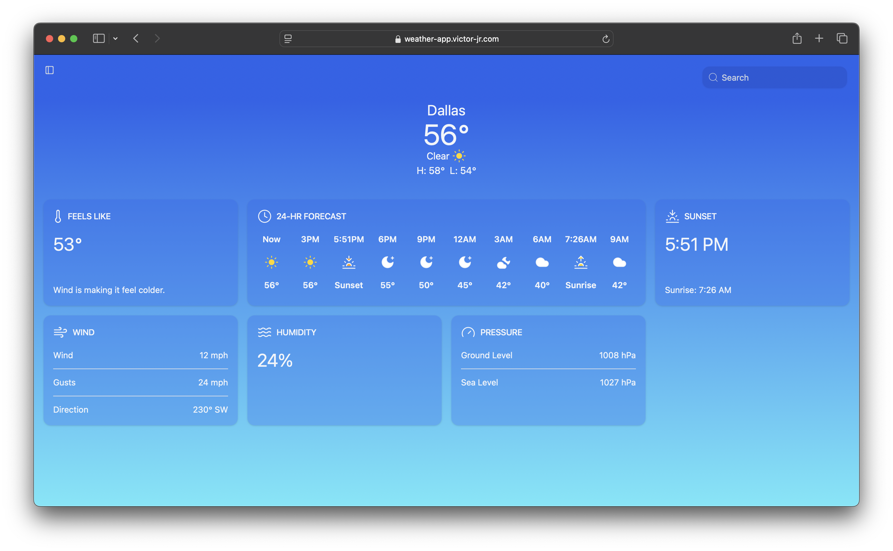
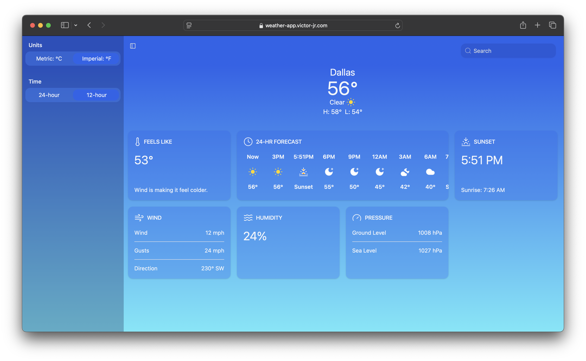
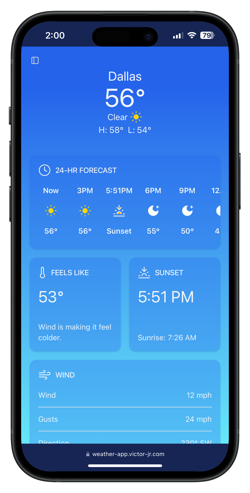
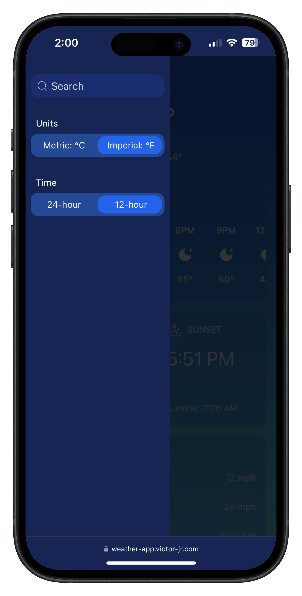

# Weather App

> [!NOTE]
> Last Updated February 07, 2025

## Summary
Inspired by Apple's weather interface, this user-friendly weather app provides real-time forecasts and detailed weather information using the [OpenWeather API](https://openweathermap.org).

## Live Demo
Access the live demo [here](https://weather-app.victor-jr.com)!

## Technologies
- [Vite](https://vite.dev/) (*v5.4.10*)
- [React](https://react.dev/) (*v18.3.1*)
- [TypeScript](https://www.typescriptlang.org) (*v5.6.2*)
- [Tailwind CSS](https://tailwindcss.com/) (*v3.4.15*)
- [Shadcn UI](https://ui.shadcn.com/) (*v2.1.6*)
- [Lucide Icons](https://lucide.dev/) (*v0.460.0*)
- [OpenWeather API](https://openweathermap.org)

## Screenshots
### Desktop View
 

### Mobile View
 
